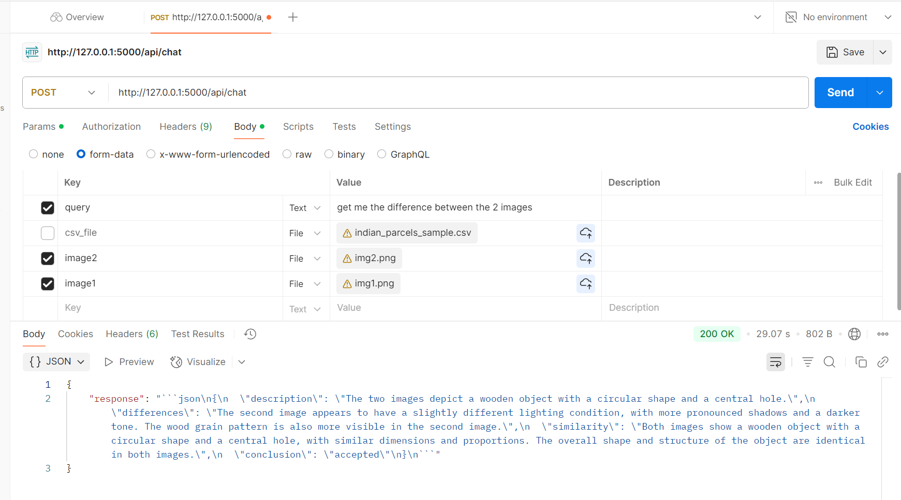

# TEAM : vectorAgents

## Overview
Welcome to our project submission for the Agentic AI Incubation Challenge. This repository showcases our end-to-end implementation of an AI-powered sustainability optimization assistant tailored for consumer goods, retail, and logistics domains. The assistant autonomously addresses operational challenges in carbon footprint reduction, waste minimization, and energy efficiency — using advanced agentic design patterns and cutting-edge technologies such as Microsoft Azure OpenAI and NVIDIA Vision APIs, LangGraph for orchestration.

In small to medium scale even in case of few big manifacturing industries, it's a common scenario to take a few sample out of the production batch and check the ration of good quality and bad quality, it's hard to quality check entire batch as it's done manually. 

If defective ratio is higher than the set threshold, entire batch is thrown away.
At times products are returned from the vendors as it did not met the quality. Leading to higher carbon emmission through more production using raw materials to meet the demand, transportation fuel burning etc.

### We are presenting a AGENTIC AI solution which handles the above challenges

Through modular tools and autonomous agents, our system is capable of:
- Identifying and reducing high-emission routes,
- Monitoring product quality through AI vision,
- Suggesting space-efficient container packing to reduce material waste and emissions.

## Explanation
Our solution aligns with the challenge use case: **AI-Powered Sustainability Optimization**. It brings together cloud-based AI tools, multimodal inputs, and classical optimization techniques to autonomously drive sustainability improvements across key operational areas.

The core functionality includes:

- **Route optimizer**  
  Uses **Azure OpenAI** to classify user intent and apply **Traveling Salesman Problem (TSP)** algorithms to suggest optimal delivery paths — helping reduce total travel distance and carbon emissions. Input: Addresses of locations and parcel dimensions. Using **openrouteservice** API as a tool, we compute the road distance of each address pari wise, considering first address as the start point. On top of distance matrix TSP is applied to find the optimized route.

- **Parcel Packing Optimizer**  
  Utilizes the **py3dbp** library to simulate **3D bin packing**, efficiently arranging parcels to reduce unused space in containers and cut down on packaging material waste. It also considers the optimised route from previous computation.

- **Carbon Emission Estimator**  
  Calculates estimated carbon footprint of both naive and optimized routes using fuel efficiency metrics — supporting **real-time emission tracking and reduction decisions**.

- **Vision Quality Inspector**  
  Leverages **NVIDIA’s Llama-4 Maverick Vision model** to compare product images and flag damaged or defective items, preventing returns and the waste they generate. We pass 2 images, i.e., first one is considered as good quality image and second as the one to be mapped with good quality. If changes in edges or color is significant the we mark it as rejected.

- **Modular Agent Flow**  
  Implements a plug-and-play architecture where agents can work autonomously or in collaboration based on user input and task complexity.

## Intent
The primary intent of our project is to demonstrate how **Agentic AI** can serve as an **autonomous sustainability manager** within the **supply chain and manufacturing ecosystems**. In alignment with the hackathon's business challenge, our system addresses the following impact areas:

### 1. Real-Time Carbon Footprint Tracking & Reduction
- **How**: Computes carbon savings from route optimization.
- **Value**: Enables greener delivery choices by recommending low-emission paths.

### 2. Smart Waste Management & Inventory Optimization
- **How**: Uses vision-based quality checks to reduce returns and product losses. Packs parcels more efficiently to reduce container and material waste.
- **Value**: Minimizes overpacking and product discards, cutting avoidable waste.

### 3. Energy Optimization for Stores & Warehouses (Indirect)
- **How**: Optimized delivery and packing reduce vehicle trips and loading bay usage.
- **Value**: Reduces energy and fuel consumption in warehouse and logistics ops.

### 4. Sustainable Supplier Selection & Procurement *(Extensible)*
- **How**: Framework can be extended to score suppliers based on emissions or ethics.
- **Value**: Enables greener sourcing through intelligent supplier switching logic.

### 5. Automated Sustainability Compliance & Reporting *(Extensible)*
- **How**: Carbon emission data can be structured for ESG dashboards and tax reporting.
- **Value**: Simplifies compliance with sustainability regulations like **EU CBAM**.

Together, these capabilities form a comprehensive solution to support **AI-driven decision making** in the journey toward **sustainable manufacturing and logistics operations**.

## Use Case
**Assigned Industry Use Case**: AI-Powered Sustainability Optimization

AI automatically tracks energy usage, material waste, and carbon footprint across the supply chain, recommending and implementing sustainability improvements.

Our solution is designed to be used by **customer support teams in logistics, courier services, or e-commerce companies**. It can be applied in scenarios such as:
- **Scenario 1**: A customer uploads an image of a damaged parcel to verify if it meets return criteria — handled by the Vision Tool.
- **Scenario 2**: A delivery coordinator asks the assistant to reorder parcel drop-offs for an optimized route — handled by the Route Optimizer.
- **Scenario 3**: A warehouse manager wants to know how to pack parcels in one container for cost-saving shipment — handled by the Container Packing Tool.

## Contributors
This project was developed by a dedicated team of contributors:
- **Bhupender Kumar**: Project Lead, Architecture Design
- **Prachi Kharb**: Prompt Flow & Azure OpenAI Integration
- **Anirudh Upadhyay**: Testing, and Deployment Support
- **Pranav Kumar**: Optimization Logic & Bin Packing Module
- **Sandeep Begad**: NVIDIA Vision Model Integration & Image Encoding 

## Images

## Implementation
Our project is composed of the following core modules:

### 1. **`agentFlow.py` – Agent Flow Controller**
- **Description**: This file defines the workflow and manages how each agent (Vision, Route, Packing) interacts in response to user queries.
- **Functionality**: 
  - Handles the orchestration of different agents based on the input received from the user.
  - Routes the user queries to the appropriate agent, such as image comparison, route optimization, or packing optimization.

### 2. **`app.py` – Main Application Entry**
- **Description**: This file serves as the main entry point for running the application. It initializes the agents and manages the user interface.
- **Functionality**:
  - Starts the web server or console interface.
  - Handles incoming requests and routes them to the `agentFlow.py` for processing.

### 3. **`carbonEmissionTool.py` – Carbon Emission Tracker**
- **Description**: This tool calculates and tracks the carbon emissions based on the optimization results for route planning and packaging.
- **Functionality**:
  - Given the optimized route and packaging data, this tool calculates the environmental impact (carbon emissions).

### 4. **`categoryTool.py` – Category Classification Agent**
- **Description**: This agent categorizes query based on predefined categories.
- **Functionality**:
  - Processes query to categorize amongst vision, optimization or general query and route it accordingly.

### 5. **`customerSentiment.py` – Sentiment Analysis Tool**
- **Description**: This tool processes customer feedback and determines whether it is positive, neutral, or negative.
- **Functionality**:
  - Analyzes text-based customer feedback, such as complaints or praises.

### 6. **`escalationAgent.py` – Escalation Agent**
- **Description**: This agent handles the escalation process if a customer issue is deemed unresolved or urgent or a negative feedback.
- **Functionality**:
  - Automatically escalates customer complaints or issues based on predefined rules.

### 7. **`generalResponseTool.py` – General Response Agent**
- **Description**: Provides generic responses to customer queries, such as greetings or general information.
- **Functionality**:
  - Returns responses for queries that do not require specific action from other agents.

### 8. **`llmCall.py` – LLM (Large Language Model) API Interface**
- **Description**: This file contains the logic for making API calls to the **Azure OpenAI** for processing large language model queries.
- **Functionality**:
  - Sends user queries to the Azure OpenAI API and retrieves model responses.

### 9. **`optimisedRouteTool.py` – Optimized Route Generator**
- **Description**: This tool is responsible for optimizing delivery routes based on various parameters like distance and traffic.
- **Functionality**:
  - Accepts user inputs such as delivery locations and optimizes the route based on shortest path or traffic conditions.

### 10. **`packParcelsTool.py` – Parcel Packing Optimizer**
- **Description**: This tool optimizes the packing of parcels into containers to minimize space usage.
- **Functionality**:
  - Takes parcel dimensions and calculates the most space-efficient way to pack them into containers.

### 11. **`routeNode.py` – Route Node Handler**
- **Description**: This file manages the succeding node route.
- **Functionality**:
  - Manages the routing nodes based on query category.

### 12. **`supportUDFs.py` – Utility Functions for Support Agents**
- **Description**: Contains utility functions that support various agents in the workflow.
- **Functionality**:
  - Includes functions for parsing, validating, and formatting data.

### 13. **`visionTool.py` – Vision Inspection Tool**
- **Description**: This tool uses **NVIDIA Llama-4 Vision** to compare images of returned parcels with reference images to detect damage.
- **Functionality**:
  - Compares images and returns the result of whether a parcel is accepted or rejected.

### 💡 Environment & APIs
- `.env` file securely stores keys and endpoints for:
  - `AZURE_OPENAI_KEY`, `AZURE_OPENAI_ENDPOINT`, `AZURE_OPENAI_DEPLOYMENT`
  - `NVIDIA_API_KEY`, if applicable

## Additional Information
- **Future Plans**:
  - Build a front-end chatbot interface using Streamlit or Gradio.
  - Managing threads and storing the results in databases for every batch.
  - Accept multiple image, different data formats and dynamic column/key names for address etc.
  - Add fallback logic using LangChain for longer conversations.
  - Extend support for live camera input in the Vision Tool.
- **Known Issues**:
  - Currently supports only base64 input for images.
  - Dynamicaly donot accept different no. of images and different file formats for parcels.
  - Assumes all parcels fit within 50x50x50 unless changed manually.
- **Acknowledgments**:
  - Thanks to Microsoft for Azure OpenAI access.
  - Thanks to NVIDIA for their state-of-the-art vision models.
  - Openroutesource API to calculate road distance.
---
